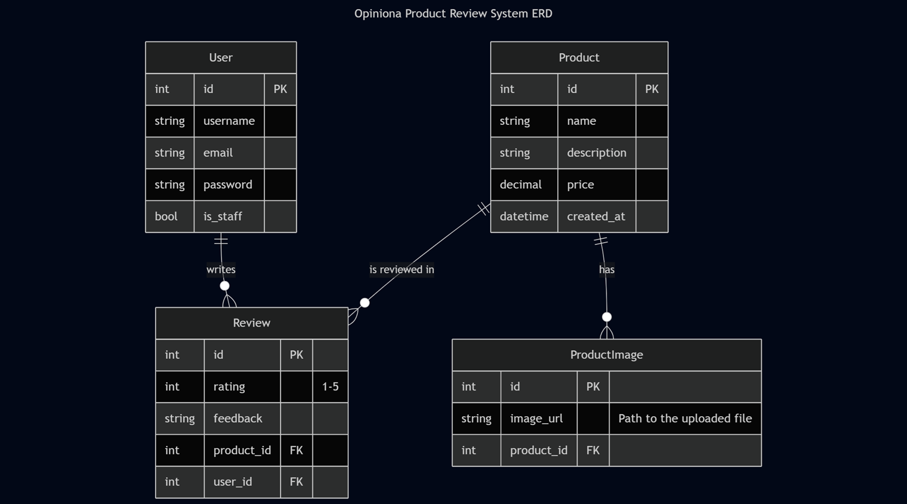

# Opiniona - Product Review System API 👋

Hey there, and welcome to the backend for **Opiniona**!

This project is a complete, robust RESTful API built with Django and Django REST Framework. It provides all the necessary functionality for a product review platform, allowing admins to manage products and users to submit reviews. It's built with best practices in mind, including a secure authentication system, role-based permissions, and a clean, test-driven architecture.

So grab a coffee, and let's get you set up!

## ✨ Core Features

*   👤 **Full User Authentication**: Secure registration, login (token-based), and logout endpoints.
*   👮 **Role-Based Permissions**: A clear distinction between **Admin Users** (who manage products) and **Regular Users** (who write reviews).
*   📦 **Complete Product Management**: Admins can create, list, view details of, update, and delete products.
*   🖼️ **Optional Image Uploads**: Admins can upload multiple images for each product.
*   ⭐️ **Review System**: Authenticated users can post a rating (1-5) and written feedback for any product.
*   🛡️ **Duplicate Prevention**: A user can only review any given product once.
*   📊 **Rating Aggregation**: Product listings automatically calculate and display the average rating from all submitted reviews.
*   ✅ **Fully Tested**: Comes with a comprehensive test suite to ensure the API is reliable and bug-free.

## 🛠️ Technology Stack

*   **Backend**: Python 3, Django
*   **API Framework**: Django REST Framework (DRF)
*   **Authentication**: DRF Token Authentication
*   **Database**: SQLite 3 (for ease of setup and development)
*   **Image Handling**: Pillow

## 🏛️ System Architecture (ER Diagram)

To give you a clear picture of how the data is organized, here’s a simple Entity-Relationship diagram. It shows our three main models, **User**, **Product**, and **Review**, and our helper model for images, **ProductImage**.

The key relationships are:
*   A **Product** can have many **Reviews**.
*   A **User** can write many **Reviews**.
*   A **Product** can have many **ProductImages**.

## 🚀 Getting Started: Setup and Installation

Follow these steps precisely, and you'll have a local development server running in just a few minutes.

#### 1. Clone the Repository
First things first, get the code onto your local machine.

    git clone <your-repository-url>
    cd Opiniona-Backend

#### 2. Create and Activate a Virtual Environment
It's super important to keep your project's dependencies isolated.

*   **On Windows (PowerShell):**

        python -m venv venv
        .\venv\Scripts\Activate

*   **On macOS / Linux:**

        python3 -m venv venv
        source venv/bin/activate

You'll know it worked if you see **(venv)** at the start of your terminal prompt.

#### 3. Install Dependencies
All required packages are listed in the **requirements.txt** file. Install them all with this single command:

    pip install -r requirements.txt

#### 4. Set Up the Database
This command will create your **db.sqlite3** file and set up all the necessary tables based on our models.

    python manage.py migrate

#### 5. Create Your First Admin User
You need an admin account to be able to add products. This command will prompt you to create one.

    python manage.py createsuperuser

Choose a username, email, and a strong password. This user will have **is_staff=True** automatically.

## ▶️ Running the Application

With the setup complete, starting the server is a one-line command:

    python manage.py runserver

Your API is now live and accessible at **http://127.0.0.1:8000/**.

## ✅ Running the Tests

We have a full suite of tests to make sure everything is working as expected. To run them, use the **test** command.

    python manage.py test

If everything is set up correctly, you'll see a lot of dots and a final **OK** message. This is your guarantee that the core logic is solid.

You can also test a single app to save time:

    # Test only the product-related endpoints
    python manage.py test products

    # Test only the review-related endpoints
    python manage.py test reviews

## 📖 API Endpoints Documentation

Here is a full guide to all available API endpoints.

---
### Authentication (/api/accounts/)

**1. Register a New User**
*   **Endpoint**: POST /api/accounts/register/
*   **Description**: Creates a new regular user account.
*   **Authentication**: Not required.
*   **Request Body**:

        {
            "username": "newuser",
            "email": "newuser@example.com",
            "password": "a-strong-password",
            "password2": "a-strong-password"
        }

*   **Success Response**: 201 Created

**2. Log In**
*   **Endpoint**: POST /api/accounts/login/
*   **Description**: Authenticates a user and returns their auth token.
*   **Authentication**: Not required.
*   **Request Body**:

        {
            "username": "someuser",
            "password": "their-password"
        }

*   **Success Response**: 200 OK with the user's token and staff status.

        {
            "token": "a1b2c3d4e5f6...",
            "user_id": 5,
            "is_staff": false
        }

**3. Log Out**
*   **Endpoint**: POST /api/accounts/logout/
*   **Description**: Deletes the user's current token, requiring them to log in again.
*   **Authentication**: **User Token Required**.

---
### Products (/api/products/)

**1. List All Products**
*   **Endpoint**: GET /api/products/
*   **Description**: Retrieves a list of all products for anyone to browse.
*   **Authentication**: Not required.
*   **Success Response**: 200 OK with a list of products.

**2. Create a New Product**
*   **Endpoint**: POST /api/products/
*   **Description**: Adds a new product to the catalog.
*   **Authentication**: **Admin Token Required**.
*   **Request Body**:

        {
            "name": "Cool Mechanical Keyboard",
            "description": "A keyboard with satisfyingly clicky keys.",
            "price": "149.99"
        }

*   **Success Response**: 201 Created

**3. View, Update, or Delete a Single Product**
*   **Endpoint**: GET, PUT, PATCH, DELETE /api/products/<id>/
*   **Description**:
    *   GET: View the full details of one product. (No auth needed)
    *   PUT/PATCH: Update a product's details. (**Admin Token Required**)
    *   DELETE: Remove a product from the catalog. (**Admin Token Required**)
*   **Authentication**: See description.

**4. Upload an Image for a Product**
*   **Endpoint**: POST /api/products/<product_id>/upload-image/
*   **Description**: Adds an optional image to an existing product.
*   **Authentication**: **Admin Token Required**.
*   **Request Body**: This must be a **multipart/form-data** request, not JSON. The key should be **image** and the value should be the image file.

---
### Reviews (/api/products/<product_id>/reviews/)

**1. List Reviews for a Product**
*   **Endpoint**: GET /api/products/<product_id>/reviews/
*   **Description**: Retrieves all reviews submitted for a specific product.
*   **Authentication**: Not required.
*   **Success Response**: 200 OK with a list of reviews.

**2. Submit a Review for a Product**
*   **Endpoint**: POST /api/products/<product_id>/reviews/
*   **Description**: Allows a logged-in user to post a review.
*   **Authentication**: **User Token Required** (regular or admin).
*   **Request Body**:

        {
            "rating": 5,
            "feedback": "This product was absolutely fantastic! Would buy again."
        }

*   **Success Response**: 201 Created

---

That's it! You should now have everything you need to run, test, and understand the Opiniona API.

Happy coding! 🚀